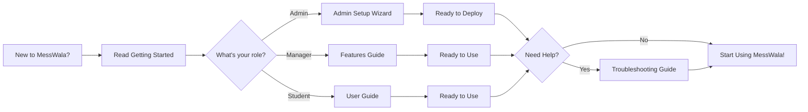

# MessWala Documentation

Welcome to the MessWala documentation portal. This is the central hub for all information about the MessWala application — a comprehensive mess management system for transparent, data-driven hostel mess operations.

**Last Updated:** March 17, 2026 | **Status:** ✅ Production Ready

---

## 📚 Documentation Structure

### 🚀 [Getting Started](guides/getting-started.md)
Quick onboarding guide for new users. Learn how to:
- Create an account
- Login (Google or Email/Password)
- Complete your profile
- Access your dashboard

### 👥 [User Roles & Permissions](guides/user-roles.md)
Understanding the three main user roles:
- **Admin** — Mess configuration & user management
- **Manager** — Expenses, menu, analytics
- **Student** — Attendance, feedback, menu view

### ✨ [Features Guide](guides/features.md)
In-depth guides for each feature:
- Expense tracking & analytics
- Meal attendance system
- Menu management
- Feedback & ratings
- Dashboard & analytics

### 🏗️ [System Architecture](architecture/system-overview.md)
Technical deep-dive:
- System architecture & components
- Database schema & models
- Configuration system
- Data flow & relationships

### 📡 [API Reference](api/endpoints.md)
Complete API documentation:
- Authentication endpoints
- Expense, meal, attendance APIs
- Analytics endpoints
- User management
- Admin setup endpoints

### 🚢 [Deployment Guide](deployment/setup.md)
Step-by-step deployment instructions:
- Frontend deployment (Vercel)
- Backend deployment (Render)
- Database setup (MongoDB)
- Environment configuration

### ⚙️ [Admin Guide](admin/setup-wizard.md)
Admin-specific documentation:
- First-time mess configuration
- User approval workflow
- Category & meal time management
- System settings

### 🔧 [Troubleshooting](deployment/troubleshooting.md)
Common issues and solutions:
- Login problems
- Data not displaying
- Configuration issues
- API errors

---

## 🎯 Quick Links

| Use Case | Link |
|----------|------|
| **First time setup?** | [Deployment Guide](deployment/setup.md) |
| **Need to configure mess?** | [Admin Setup Wizard](admin/setup-wizard.md) |
| **Want to integrate API?** | [API Reference](api/endpoints.md) |
| **Understanding the system?** | [System Architecture](architecture/system-overview.md) |
| **Forgot how to use a feature?** | [Features Guide](guides/features.md) |
| **Setting up user roles?** | [User Management](admin/user-management.md) |

---

## 📱 System Information

**Current Version:** 2.0 (Dynamic SaaS Release)

**Key Technologies:**
- **Frontend:** React + Vite + Tailwind CSS
- **Backend:** Node.js + Express
- **Database:** MongoDB
- **Hosting:** Vercel (Frontend) + Render (Backend)
- **Authentication:** JWT + Google OAuth

**Supported Browsers:**
- Chrome/Edge 90+
- Firefox 88+
- Safari 14+
- Mobile browsers (iOS Safari, Chrome Mobile)

---

## 🔐 Security

MessWala follows industry best practices:

- ✅ HTTPS-only communication
- ✅ JWT token-based authentication
- ✅ HTTP-only secure cookies
- ✅ Password hashing (bcrypt)
- ✅ Rate limiting
- ✅ CORS protection
- ✅ MongoDB Atlas encryption
- ✅ Regular security audits

---

## 🤝 Support & Community

**Need help?**
- Check [Troubleshooting Guide](deployment/troubleshooting.md)
- Review [FAQs](guides/features.md#faqs)
- Contact your mess admin

**Found a bug?**
- Report on [GitHub Issues](https://github.com/soumyadeepsarkar-2004/MessWala/issues)
- Include steps to reproduce
- Attach screenshots if applicable

**Want to contribute?**
- See [CONTRIBUTING.md](https://github.com/soumyadeepsarkar-2004/MessWala/blob/main/CONTRIBUTING.md) in the repository
- Fork the repo and submit PRs
- Follow code style guidelines

---

## 📖 Documentation Management

This documentation is:
- **Version controlled** — Tracked in Git
- **Searchable** — Full-text search enabled
- **Responsive** — Works on desktop and mobile
- **Offline-capable** — Can be downloaded as PDF
- **Continuously updated** — Latest version always available

---

## 🚀 Getting Started Path

---

## 📞 Contact & Support

| Topic | Contact |
|-------|---------|
| **Technical Issues** | [GitHub Issues](https://github.com/soumyadeepsarkar-2004/MessWala/issues) |
| **Feature Requests** | [GitHub Discussions](https://github.com/soumyadeepsarkar-2004/MessWala/discussions) |
| **Security Issues** | Report privately via GitHub Security Advisory |
| **Admin Support** | Contact your mess administrator |

---

**Last Updated:** March 17, 2026  
**Version:** 2.0 (Dynamic SaaS Release)  
**Status:** ✅ Production Ready

---

## 📄 Legal

- **License:** See [LICENSE](https://github.com/soumyadeepsarkar-2004/MessWala/blob/main/LICENSE)
- **Privacy Policy:** TBD
- **Terms of Service:** TBD
- **Contributing:** See [CONTRIBUTING.md](https://github.com/soumyadeepsarkar-2004/MessWala/blob/main/CONTRIBUTING.md)
